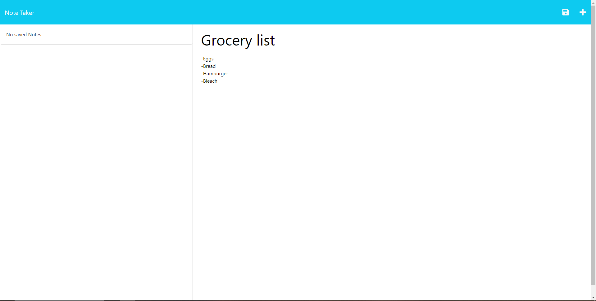
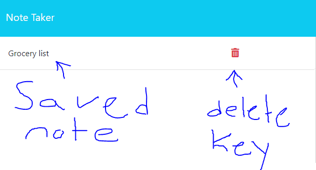
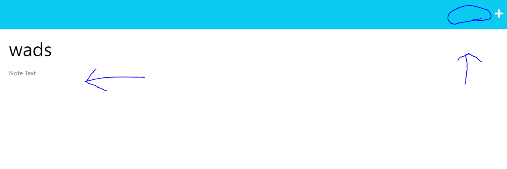
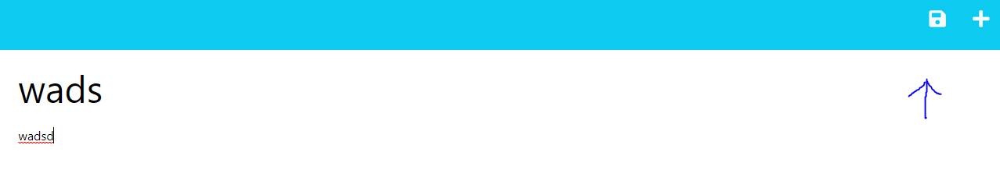
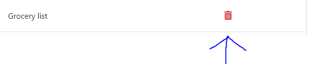

# Note taker


## Description


With this easy to use application the user can keep track of there daily, weekly, and even monlthy task. With the delete function once a task is complete the user can get rid of it from there saved notes.



## Table of Contents


- [Installation](#installation)
- [Usage](#usage)
- [License](#license)
- [Questions](#questions)


## Installation

```
No sign up or obligation to the app just use the link hit "Get started " and the information will be saved to your local device.
```

## Usage
A couple cool functions to look out for with this application.
- The save button will not show until the user has filled out both sections of titles and body.


- The delete button will get rid of your note make sure you want to delete it there is no way to recover a note once its deleted!



## License

 [MIT](https://opensource.org/licenses/MIT)

## Questions


If you have any questions about the repo, open an issue or contact me directly at mathewandnana@gmail.com. You can find more of my work on git hub at NRDmatt.